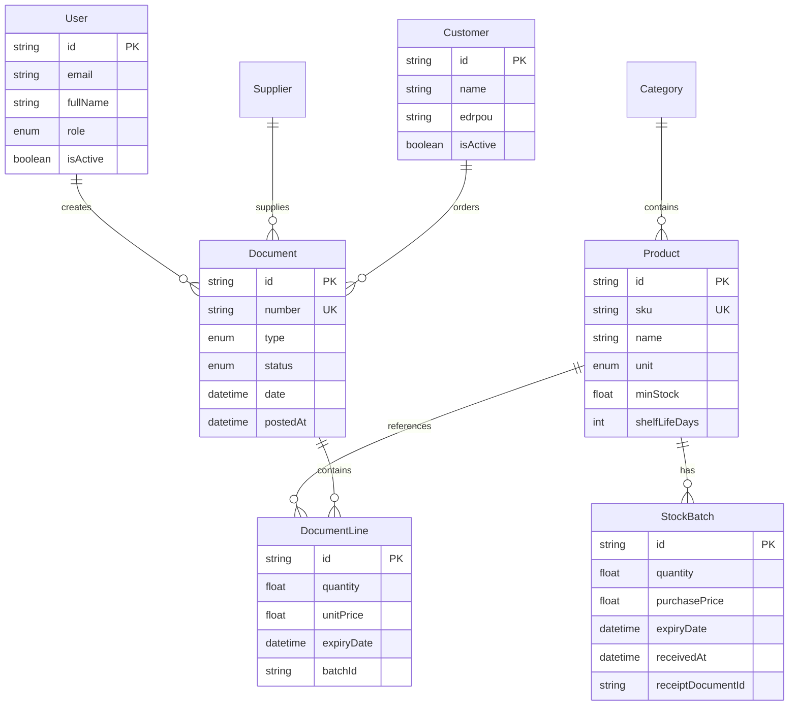
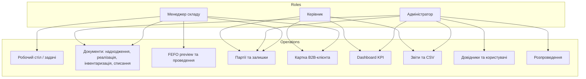
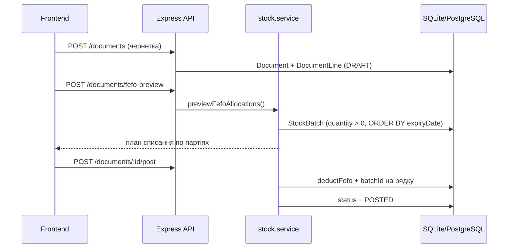

# ОптСклад — діаграми для пояснювальної записки

## ER-діаграма (основні сутності)

## Діаграма випадків використання

## Потік документа «Реалізація»

## Ролі та доступ (матриця)

| Розділ | MANAGER | ADMIN | DIRECTOR |
|--------|---------|-------|----------|
| Робочий стіл | ✓ | — | — |
| Документи (створення/проведення) | ✓ | ✓ | перегляд |
| Партії / Залишки | ✓ | ✓ | ✓ |
| Клієнти | ✓ | ✓ | ✓ |
| Товари (редагування) | перегляд | ✓ | перегляд |
| Аналітика / Звіти | — | ✓ | ✓ |
| Довідники / Команда | — | ✓ | — |
| Розпроведення | — | ✓ | — |
